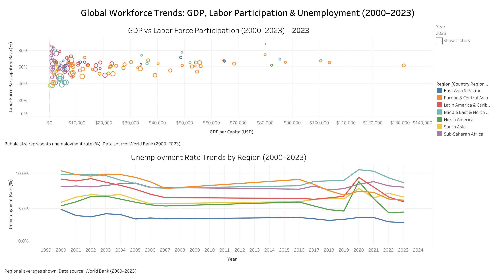

# 📊 Tableau Dashboards

This folder contains the Tableau dashboards created for the **Global Workforce & Economic Trends (2000–2023)** project.  
Each dashboard is available as:
- **Interactive link** on Tableau Public  
- **Packaged workbook (.twbx)** for local exploration  
- **Static PNG preview** for quick reference  

---

## 🌍 1. World GDP per Capita (2023 Snapshot)

**Interactive Dashboard:**  
[View on Tableau Public](https://public.tableau.com/views/WorldGDPperCapita2023Snapshot/WorldGDPperCapita2023Snapshot?:language=en-GB&publish=yes)

**Preview:**  

**File:** `GDP_Dashboard_2023.twbx`

---

## 👷 2. Global Workforce Overview (2023)

**Interactive Dashboard:**  
[View on Tableau Public](https://public.tableau.com/views/GlobalWorkforceOverview2023/GlobalWorkforceOverview2023?:language=en-GB&publish=yes)

**Preview:**  

**File:** `Global Workforce Overview, 2023.twbx`

---

## 📊 3. Global Workforce Trends (2000–2023)

**Interactive Dashboard:**  
[View on Tableau Public](https://public.tableau.com/views/GlobalWorkforceTrendsGDPLaborParticipationUnemployment20002023/GlobalWorkforceTrendsGDPLaborParticipationUnemployment20002023)

**Preview:**  

**File:**  
`Global_Workforce_Trends_ GDP, Labor Participation & Unemployment (2000–2023).twbx`
